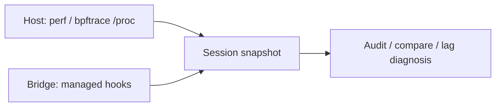

# Native-to-managed correlation (C# bridge)

**Owns:** how the optional managed bridge relates host samples to game methods.  
**Not:** host collector inventory ([APM](APM.md)), CLI feature list ([FEATURES](FEATURES.md)), install ([../bridge/README.md](../bridge/README.md)).

Host samples explain where the process blocks or consumes CPU; the bridge names
instrumented game methods in the same capture window. Correlation is evidence
only when timestamps overlap and both collectors are usable.

## What the bridge reports

| Signal | Notes |
|---|---|
| `GameManager.gmUpdate` duration | Separate from server tick interval |
| Normal section hooks | Every invocation |
| Deep entity / EAI / path hooks | Gated by `DeepSampleRate` (bound overhead) |
| Snapshot metadata | Bridge version, patched signatures/tokens, assembly version/SHA-256, schema, sample rate, dropped exports, export errors |

Section totals from different sample rates must not be compared as raw totals;
use per-call distributions and matching configuration.

A missing hook is **unavailable evidence**, not a zero-cost method. Recommendations should reference a structured signal and its source artifact.

## Install / ops

Bridge build and install live under `bridge/` (see [`../bridge/README.md`](../bridge/README.md)). Host capture issues only `apm status`, `apm capabilities`, and `apm dump`; it then copies a fresh structured snapshot. EfficientServer is **not** an instrumentation dependency.

Automatic Harmony source generation was removed because heuristic patch output was unsafe to present as production code.

## Related docs

| Doc | Role |
|---|---|
| [APM](APM.md) | Capture and evidence model |
| [FEATURES](FEATURES.md) | CLI capabilities |
| [COMPATIBILITY](COMPATIBILITY.md) | Game / kernel / probe matrix |
| [LOAD_PROFILE](LOAD_PROFILE.md) | Canonical compare workload |
| Research loop | [`../../7dtd-engine-research/docs/loop.md`](../../7dtd-engine-research/docs/loop.md) |

## Changelog

- **2026-07-19:** Ownership; mermaid; related docs; expanded from thin note.
